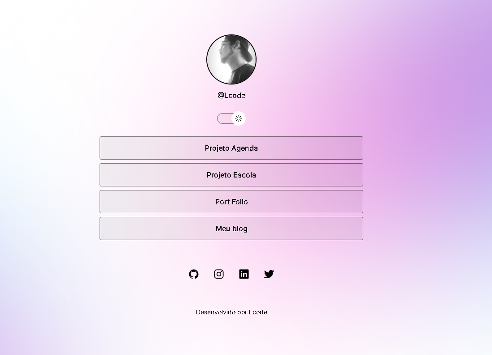
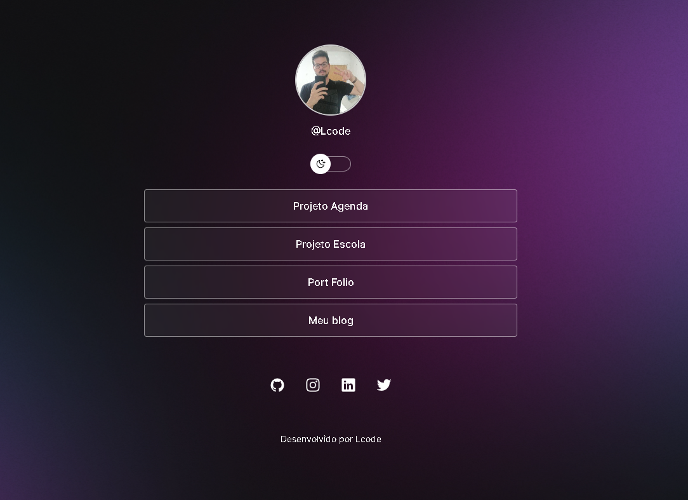

<h1 align="center"> Projeto SM Links </h1>

<h1> Projeto Desenvolvido com as Tecnologia:</h1>

  <ul>
  <li> Html</li>
  <li> Css</li>
  <li> JavaScript </li>
  <li> Git & Github</li>
  </ul>

<h1> Imagem do Projeto </h1>

 
 
 <h1>Modo Light </h1>
 
 

 
 
 <h1>Modo Dark </h1>
 
 

